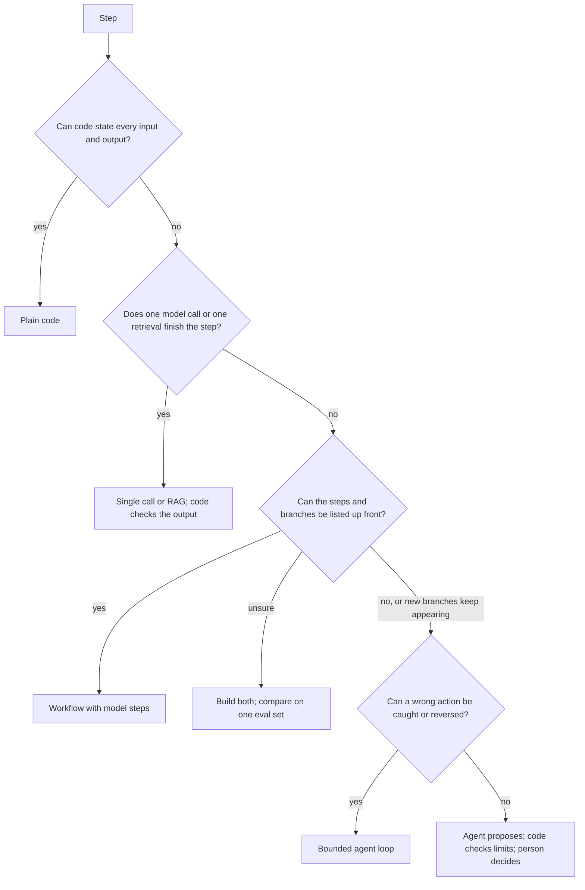

# Step shape and autonomy

Citation keys such as [SYSTEMS ch6] point to the book list under Sources in SKILL.md.

Use this to place every step of a task on the spectrum and to set its authority. Decide per step, never once for the whole system.

## Working definition

An agent is a system in which a model, inside a loop that code owns, chooses at least some of the next actions (which tool, with what arguments, whether to continue) from what earlier actions returned, until a stop condition fires.

Consequences:
- A router is a workflow with one model decision.
- An LLM step inside a fixed pipeline is not an agent, even if the stage has a role name.
- A model that picks a tool, sees the result, then answers is the smallest agent.
- A loop with nobody in code owning tools, state, validation and the stop rule is the dangerous version [SYSTEMS ch6].

To check a vendor or teammate's "agent" for agent-washing (a script or chatbot relabelled [MESH ch1]), ask where model output decides control flow and what bounds it, and ask for a trace of a real run.

## The spectrum (who decides the next step)

| # | Shape | What the model's output controls |
|---|---|---|
| 1 | Plain code | Nothing; no model |
| 2 | Single model call (classify, extract, summarise, draft, RAG answer) | Nothing downstream; output is data that code routes |
| 3 | Fixed workflow with model steps | At most which predefined branch runs |
| 4 | One tool call | Which function runs, with which arguments |
| 5 | Bounded agent loop | Which action next and whether to continue, inside code-owned bounds |
| 6 | Open-ended agent | Its own tools and control graph. Not achievable today [DEFGUIDE ch1]; do not design for it |

Most production systems sit at 3 to 5. Agentic systems run "orchestrated autonomy": choosing among predefined states, transitions and tools at run time, never redesigning them [DEFGUIDE ch1].

## Two dials, set separately

- **Agency** (the spectrum): how much control flow the model's output decides.
- **Authority**: how far the step acts without a person: `suggest` → `approve` (person approves each action) → `act and notify` → `act`.

A bounded agent loop can run with every write held for approval; a fixed workflow can post payments unattended. A more capable model does not by itself justify more of either dial. Capability gains are a reason to re-run the per-step decision, not an authority grant (METR's note on its own time-horizon metric says a 50% horizon of X hours does not mean tasks under X hours can be delegated; some tasks need 98%+ success to be worth automating).

When someone cites a "level 3" or "level 4" agent, ask which axis: technology stack (AGENTICAI's levels 0 to 5 [AGENTICAI ch2]), control flow (the spectrum above), or human role (operator, collaborator, consultant, approver, observer, from Feng et al.). Numbers from different schemes do not translate. AGENTICAI calls its levels a catalogue to choose from, not a maturity ladder [AGENTICAI ch2].

## Per-step decision flow

Run it once per step. Stop at the first "yes".



Q3 is where teams reach for an agent too early. Answer it in writing: name what the step must discover at run time that decides its next action. If you cannot name it, the step is a workflow.

The ordering follows the ladder in [BUILDAPPS ch1] (simple code, deterministic workflow, RAG, agent; chosen by input variability, reasoning complexity, performance and compliance constraints, maintenance burden) and the rule in [SYSTEMS ch6]: use an agent when "the next step depends on what the system discovers while running".

## Shape catalogue

| Shape | Use when | Avoid when |
|---|---|---|
| Plain code | Inputs fully predictable; millisecond latency; certification needs deterministic, auditable logic (a fixed log format is a regex, not a model) [BUILDAPPS ch1] | Free-text inputs with open-ended variety |
| Single model call | One transformation of unstructured input; code or a person checks the output | What happens next depends on the output in ways you cannot enumerate |
| RAG pipeline | Questions answered from a corpus; no follow-up actions | The system must act: file, schedule, change records |
| Workflow with model steps | Branches can be listed; you need a branch-by-branch audit trail or strict reliability [DLLMA ch10] | A new edge case forces a new branch every week |
| Workflow skeleton with one agent step | Most steps fixed, one or two need judgment about what to do next. The most common production answer [AGENTICAI ch8] [BUILDAGENTIC ch1] | Every step needs judgment, or none does |
| Bounded agent loop | The next step depends on what was found; inputs novel or highly variable; a wrong step can be caught | Path predictable; zero error tolerance and no reviewer |
| Agent proposes, person decides | Variable inputs and costly or irreversible actions | Reviewers cannot judge the proposal or will rubber-stamp it |
| Open-ended harness (coding, deep research, assistant) | Goal is checkable, environment sandboxed, effects reversible. Coding agents work because output can be verified automatically [ILLUSTRATED ch1] | It holds write access to systems of record |

If an agent has been constrained until it has no autonomy left, replace it with a software module [ENTERPRISE ch1].

### Signals to move a step up or down

Up (workflow → agent step):
- The step's branch count keeps growing; each unforeseen input gets a patch [MESH ch3].
- Early misreadings cascade through the fixed chain.
- Inputs range widely (a support inbox spanning a swelling battery to a disputed bill would "shatter" a rule-based workflow [BUILDAPPS ch1]).

Down (agent → workflow or code):
- Traces show the agent takes the same path almost every time.
- The baseline comparison (below) shows no gain beyond the threshold.
- The step needs full accuracy (financial calculation, compliance check) [AGENTICAI ch8].

Change one step, not the whole system.

## Authority per step

Place each step by input variability and the cost of a wrong action.

| | Reversible or cheap to be wrong | Irreversible or costly |
|---|---|---|
| **Predictable** | Automate (`act`) | Deterministic and audited; approval above a threshold in code |
| **Variable** | Agent acts; people sample results (`act and notify`) | Agent gathers evidence and proposes; code checks hard limits; a person decides (`approve` / `suggest`) |

The variable-and-costly cell is where most design work goes. Code running in a container has controllable consequences; actions on real accounts need scrutiny [ENTERPRISE ch1]. Rules that need consistency go in the coded part, reasoning over unstructured input in the LLM part [ENTERPRISE ch1].

Human intervention triggers that hold across sources: a failure threshold exceeded, and high-risk or irreversible actions (OpenAI's practical guide names both). Designing the approval itself so it is not a rubber stamp belongs to agent-threat-modeler.

### "Reversible" and "cheap", defined per domain

Write both definitions into the design doc before placing steps in the matrix.

- **Reversible:** the system itself can undo the action fully, at negligible cost, before harm lands. Drafts, holds, internal notes, status flags and staged changes qualify. Money sent out, messages to customers or third parties, a denial communicated to a customer, deletions and anything that starts a legal clock do not, even when a clawback or correction is technically possible.
- **Cheap:** the expected loss of one wrong action (probability × impact, including remediation, customer and regulatory cost) is below what the organisation already accepts without review today. Look for an existing tolerance: an auto-approval limit, a write-off limit, a QA sampling rate. If none exists, treat the action as costly.

### Mapping a client's approval rule onto the matrix

A rule such as "an adjuster must approve any payout over $5,000" is a **floor on oversight**, not a statement that everything below it may be automated.

1. **Pin the measure.** Per payment or per case; gross or net (deductible, salvage, tax); including or excluding earlier payments on the same case; currency. Compute it in code from the system of record, never from a model-extracted figure. Aggregate per case (or per claimant and period) so a payout cannot be split into several sub-threshold ones.
2. **Above the threshold:** `approve`, enforced in the action path. The model's confidence never lowers it.
3. **Below the threshold:** place the band in the matrix like any other step. A variable, irreversible step below the threshold usually starts at `suggest` in v1.
4. **Record the band plan** in the step map: for example "≤ threshold: suggest in v1, eligible for act-and-notify after graduation; > threshold: approve, never graduates".
5. **Unclear rule:** if the client's intent is ambiguous (floor or target), say which reading the design uses and list it under "Confirm first".

### Regulated and adverse decisions

Adverse decisions are denials, reductions, cancellations, eligibility and pricing outcomes, fraud or investigation referrals, and anything that carries a notice duty or an appeal right.

- **Decider:** a person in v1. The agent may recommend and assemble evidence. Automating the decision needs explicit permission from the client's policy and the applicable regulation, recorded in the decision log.
- **Decision record per case:** the decision; reason codes from a fixed, versioned list (code or the person picks them, not model free text); evidence references that resolve (document, page, field); rule and policy version; model and prompt versions; recommender and decider; timestamps; any override and its reason.
- **Model rationale** helps the reviewer; it is not the reason of record.
- **Out of scope here:** jurisdiction-specific rules (adverse-action notices, fair-claims practice, explainability, fairness testing, model risk management) go to agentic-business-case for governance and to agent-threat-modeler for the oversight design.

### Raising authority over time

Authority is raised per step, on evidence, never because a model got better. A model or prompt change triggers re-validation at the current stage, not promotion.

| Stage | What happens | Typical entry criterion (set the numbers with agent-eval-designer) |
|---|---|---|
| Shadow | Runs on live traffic; output stored, not shown or not used; compared with the human decision | Eval passes offline |
| Suggest | A person sees the draft or proposal and decides | Shadow agreement at or above target over N cases |
| Approve | The proposed action executes after a one-click human approval | Acceptance without edits at or above target over M weeks; override reasons reviewed |
| Act and notify | Executes; people review a sample | Sustained acceptance, zero Critical incidents, a rollback tested |
| Act | Fully automatic | Only for reversible or cheap steps |

Each stage also needs a rollback trigger (metric drop below a floor, any Critical incident) that reverts automatically to the previous stage, and a named person who signs off promotion. Above-threshold actions and adverse decisions stop at `approve` unless governance decides otherwise.

## Evidence for "least autonomy that works"

The one head-to-head measurement in the source library [BUILDAGENTIC ch4]: text-to-SQL on BIRD, same model, fixed workflow versus a ReAct agent with three tools.

| | Workflow | Agent |
|---|---|---|
| Accuracy | 48.9% | 52.1% |
| Median latency | 2.53 s | 4.84 s (1.9×) |
| Median cost per question | $0.00002 | $0.00007 (3.5×) |

The two accuracies were scored by different methods, so the 3-point gap is inside the noise. The agent fetched the schema in only about 80% of runs. It needed far less code. Conclusion adopted here: when the path is known, a workflow matches accuracy at lower cost and latency, and the way to know is to build both and test on one dataset.

Agents can improve in use only if you build the mechanism: the same chapter's agent climbed from 37.7% to 67.2% only on a variant where questions recurred, with a purpose-built note-writing tool and a long warm-up [BUILDAGENTIC ch4]. Any claim that "the agent will learn" must name the mechanism, the eval showing the gain, and who maintains it.

Every step up the spectrum adds a failure class: RAG adds retrieval quality, tool use adds execution and permission failures, agents add loop control, state, observability and failure propagation [SYSTEMS ch6].

## Build-both comparison (for "unsure" steps)

1. One labelled case set and one scorer for both designs.
2. **Pick one primary metric** tied to the error the step's consumer pays for: recall of discrepancies when a miss is costly, precision when false alarms waste reviewer time, agreement with an adjudicated decision for recommendations. Accuracy is the default only for classification-shaped outputs.
3. **Set guardrails** on the other metrics as non-inferiority limits: for example, precision no more than a few points worse, cost at most k times, p95 latency within the target.
4. **Derive the minimum gain before running.** It is the larger of:
   - break-even: (extra cost per case of the agent + its added maintenance) ÷ (cost of one error avoided), plus a margin for the added complexity;
   - detectability: the smallest difference the case count can distinguish from noise.
   A difference smaller than the detectable one counts as a tie.
5. **Handle noisy ground truth.** Past human decisions disagree with each other. Have two experts relabel a sample and adjudicate, measure their agreement, and treat it as the ceiling. Score both designs on the adjudicated sample. A difference smaller than the label noise is a tie.
6. Report the primary metric, guardrails, p50 and p95 latency, median cost, and worst-case model calls (the worst case sizes the agent's step budget).
7. Repeat agent runs per case; agent paths vary between runs, so score consistency too.
8. Keep the less autonomous design unless the agent clears the bar on the primary metric without breaking a guardrail. A tie goes to the simpler design.

Sample sizes, confidence intervals, paired tests and judge calibration belong to agent-eval-designer.

```python
def choose(workflow, agent, primary, min_gain, max_ratio):
    """workflow/agent: metric dicts. max_ratio: caps for lower-is-better metrics, e.g. {'cost': 3, 'p95_s': 1.5}.
    The simpler design wins ties and any broken guardrail."""
    gain = agent[primary] - workflow[primary]
    broken = [m for m, cap in max_ratio.items() if agent[m] / workflow[m] > cap]
    return ("agent" if gain >= min_gain and not broken else "workflow"), gain, broken
```

## Worked example: accounts-payable inbox

| Step | Shape | Authority | Why |
|---|---|---|---|
| Fetch email, store attachments | Plain code | act | Fully specified |
| Parse invoices from known vendor templates | Workflow routed by sender | act | Known formats [BUILDAPPS ch1] |
| Extract fields from an unfamiliar PDF | Single model call into a schema, validated by code | act if valid, else person | One transformation |
| Match to purchase order, reconcile | Plain code | halt for review on mismatch | Deterministic, auditable |
| Answer free-form vendor emails | Bounded agent loop: look up PO, payment status, history; draft reply | suggest (agent drafts, person sends) | Next lookup depends on the last; replies carry commitments |
| Change vendor bank details | Code plus a person, verified out of band | never delegated | Classic fraud vector |
| Release payment | Workflow with approval policy in code | approve above threshold | Predictable and costly |

One step in seven is an agent. That ratio is typical: AGENTICAI's report generator was about 80% deterministic automation and 20% LLM agent, and the deterministic half shipped first [AGENTICAI ch8].
