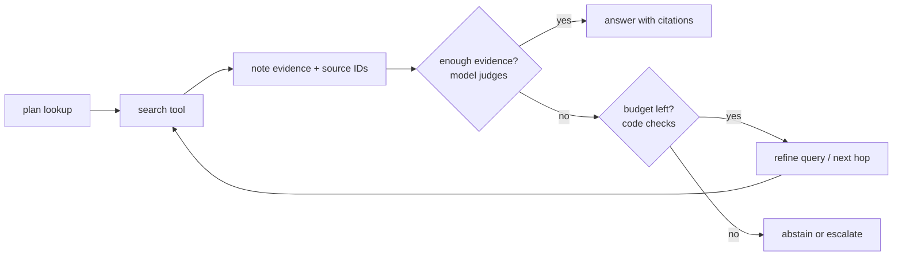

# Retrieval pipeline reference

Depth for Procedure steps 3-4. Citation keys like [SYSTEMS ch5] are expanded in SKILL.md under Sources.

Contents: 1 Mode · 2 Index time (2.5 stale documents, 2.6 mixed or sensitive sources) · 3 Query time (3.4 several indexes) · 4 Agentic retrieval · 5 Graph and structured retrieval · 6 Caching · 7 Debug order

A RAG system is two pipelines that meet at an index. Index time: parse, chunk, attach metadata, embed, index. Query time: understand the query, search wide, narrow, assemble, generate. Read query time as a funnel. The first stage is judged by **recall** (did the evidence reach the candidate set at all?), later stages by **precision** (how much of what reaches the model is useful?). Nothing downstream recovers a document the first stage missed [DLLMA ch12 §The RAG Pipeline], and a failure usually runs down the chain: bad chunking, then weak retrieval, then poor ranking, then a thin context [SYSTEMS ch5 §5.10 Retrieval Quality Shapes Answers].

```
index time:  sources -> parse -> chunk (+doc/section context) -> metadata (+ACL, version) -> BM25 index + vector index
query time:  question -> split instructions / rewrite? -> BM25 ∥ dense (ACL pre-filter) -> RRF fuse (~50)
             -> rerank -> floor -> keep 3-5 -> dedupe/compress -> insert with IDs -> answer with citations | "not found"
```

## 1. Pick the mode

| Mode | Use when | Avoid when |
|---|---|---|
| No retriever, whole corpus in a cached prefix | Small, stable corpus that is the same for every user. Anthropic's contextual-retrieval post suggests this below about 200k tokens (external) | Corpus grows or churns; permissions differ per user; cost-sensitive traffic |
| Always-retrieve pipeline | Private or changing corpus; nearly every question needs it | Many inputs need no lookup (greetings); route those around retrieval [BUILDAGENTIC ch2] |
| Retrieve-or-not gate | Open-domain questions, large models, latency matters | Proprietary, regulated or fast-changing data. Always retrieve there and let the model abstain [DLLMA ch12 §Deciding When to Retrieve] |
| Retrieval as a tool (agentic RAG) | Several sources; the next lookup depends on the last result; one query can't cover the corpus | One well-designed lookup already answers reliably |
| Plan-and-search research loop | Open-ended research over many pages | Interactive latency; simple lookups |
| Text-to-SQL with retrieved schema hints | The answer lives in tables | Free text |
| GraphRAG | Relation chains, corpus-wide themes, and you have tested those question types | Independent documents; no budget to maintain a graph |

The books disagree on the default. One presents agentic RAG as the natural next step [ILLUSTRATED ch4 §Agentic Retrieval-Augmented Generation]. Two others keep the fixed pipeline as the default because it is easier to build, test, cache, monitor and tune ([SYSTEMS ch5 §5.15 Advanced RAG: From Retrieval to Navigation]; [DLLMA ch10 §LLM Interaction Paradigms]). The measurements back the cautious position (section 4), so start with a fixed pipeline and add agent control only when you can name the reason.

Long context does not replace retrieval. Bigger windows cost more per call, add latency, and give no guarantee that the model finds the one relevant passage. Needle tests use unrelated filler, while real distractors are related text ([DLLMA ch12 §RAG Versus Long Context]; [BUILDAPPS ch6]). Chroma's Context Rot study (external, 2025) found accuracy dropping with input length across 18 models, and dropping faster when distractors were present.

## 2. Index time

### 2.1 Parsing
- Extracting sections, tables and figures from mixed formats is where a large share of RAG failures start [DLLMA ch11 §Chunking]. Before tuning anything else, inspect the parsed output of each document type: multi-column PDFs, tables, headers and footers, scanned pages.
- Keep structure: heading path, table rows with their headers, page numbers (for citations).

### 2.2 Chunking: climb the ladder only as far as measurement says
| Rung | What | Use when |
|---|---|---|
| Sliding window with overlap | Fixed-size chunks; overlap keeps a sentence cut at a boundary whole in one of them (one book shows 100-token chunks with 20 tokens of overlap) [SYSTEMS ch5] | Unstructured text, a first baseline |
| Structure-aware | Cut at paragraphs and sections; carry the heading path as metadata | **Default** for manuals, policies, contracts, wikis |
| Layout-aware | Knows a subsection's scope, so its title is prepended to every chunk from it; vision retrievers embed whole pages | Long structured reports; layout carries the meaning |
| Semantic | Group sentences by topic shift | Rambling text without structure |
| Late chunking | Embed the whole document with a long-context embedder, then pool per segment | Chunks depend heavily on document context |
| Small-to-big | Embed sentences, return the parent chunk | Precise matching, but the answer needs surrounding text [DLLMA ch11 §Chunking] |

- **Chunk context.** A chunk loses meaning once it is cut out of its document. In DLLMA's filing example, page 5 says all figures are in millions and page 84 says $213.45, so no chunk from page 84 carries the unit [DLLMA ch11 §Chunking]. The fix is to prepend document title, section path and, where needed, a 50-100-token LLM-written situating sentence before both embedding and BM25 indexing (Anthropic's contextual retrieval, external; figures in provider-notes.md).
- **Chunk size.** No book gives an ideal size. Test two or three granularities against your real queries [DLLMA ch11 §Chunking]. Keep an answer from being split across a boundary [EVALS ch7].

### 2.3 Metadata schema (per chunk)
`chunk_id, doc_id, title, section_path, page, source, doc_type, version or effective_date, language, product, tenant_id, acl_groups, content_hash, indexed_at`

- Filter on these inside the search ([SYSTEMS ch5 §5.9 Metadata Filtering]). Filters can come from rules or from an LLM that parses the query [DLLMA ch12 §Retrieve].
- **ACLs are the field most often missing.** Embeddings copied out of secured systems lose the access rules that governed them [MESH ch1 §The Agent Opportunity]. Carry them as metadata, sync them when the source changes, and enforce them per query from the authenticated identity.

### 2.4 Embeddings (basics; model choice goes to agent-model-selector)
- Use the same model for queries and documents. Use the similarity measure the model was trained with. With unit-normalised vectors, dot product equals cosine and costs less ([BUILDAGENTIC ch2]; [DLLMA ch11 §Similarity Measures]).
- Short query against a long passage is an asymmetric workload, so prefer models trained for asymmetric search [DLLMA ch11 §Semantic Search].
- **Similarity is not relevance.** "He is not retiring" scored 0.787 against "announced his retirement" and 0.768 against "did not announce his retirement" [DLLMA ch11 §Similarity Measures]. Absolute scores vary by model, so calibrate any threshold on your own data.
- Switching embedders is rarely the first fix. Seven embedders on the same evidence scored recall@10 between 0.610 and 0.720, the top five within 0.021 of each other, and domain mattered more than model [BUILDAGENTIC ch3 §Evaluating Evidence Retrieval]. Fix parsing, chunking, filters and corpus gaps first.
- At scale: 100M 768-dim float32 vectors take about 300 GB. Matryoshka truncation and binary quantisation cut that with some loss [DLLMA ch11 §Optimizing Embedding Size]. Fine-tune with hard negatives when the vocabulary is unusual; a few thousand pairs can be enough [DLLMA ch11 §Fine-Tuning Embedding Models].

### 2.5 Freshness, staleness and deletion
- Re-index on change, keyed by `content_hash`. Retire superseded versions or mark them. Stale and conflicting documents leave the model guessing ([SYSTEMS ch16 §16.10 Retrieval-Augmented Generation Integration]; [DLLMA ch12 §Limitations of RAG]).
- Deleting a source must remove its chunks, vectors and any cached retrievals or answers that used them.

**When documents carry no version or effective date** (the usual case for wikis), derive a status per document at index time and store it as metadata: `status` (`current`, `needs_review`, `deprecated`, `archived`), `last_modified`, `owner`, `supersedes`.

| Signal | How to detect it | Action |
|---|---|---|
| Explicit markers | Archive spaces, "deprecated" or "obsolete" labels and banners, an old year in the title, "replaced by" links | `deprecated` or `archived`; excluded by filter |
| Near-duplicate pairs | Document-level embedding or shingle overlap within one space or topic, above a threshold you calibrate on a reviewed sample | Newer `last_modified` stays `current`; the older one becomes `needs_review` with a candidate `supersedes` link |
| Age by document type | `last_modified` older than a per-type limit (start around 12 months for how-tos and procedures, longer for stable policies; tune) | `needs_review`; still retrievable, but flagged |
| Feedback | Users report "this is outdated", or mark answers wrong that cited the document | Owner review queue |
| Conflict at answer time | Two retrieved items disagree | Prefer `current`, then the newer one; tell the user the sources disagree and cite both |

- **Owner review queue.** Send `needs_review` documents to their owner (page owner or space admin) with three choices: keep (resets the clock), update, deprecate. Without that loop the flags only pile up.
- **Freshness against relevance.** A blanket recency boost pushes newer but less relevant documents up. Instead: filter out `deprecated` and `archived`, use recency as a tie-breaker inside near-duplicate clusters, and apply a mild age decay only to document types that age (release notes, how-tos). Check the effect on the stale-version test slice.
- Put `last updated <date>` and `status` in each evidence header, and tell the model to mention the date when it cites a `needs_review` document.

### 2.6 Mixed or sensitive sources (tickets, email, chat logs)

Some sources are knowledge, live state and personal data at once. A helpdesk ticket holds a resolution other people could reuse, the reporter's current case status, and names, devices and sometimes credentials. Don't index such records raw into a shared corpus. Split them by use:

| Use | Store | Built how | Who can read it | Retention |
|---|---|---|---|---|
| Reusable knowledge | Sanitised "case card" index: problem, environment, symptoms, resolution steps, outcome, source ticket ID | Batch job over resolved tickets with a confirmed fix. An LLM drafts the card; a PII and secret scrubber removes names, emails, person-linked hostnames and credentials; review a sample before publishing | Everyone allowed that knowledge class. Exclude sensitive categories (security incidents, HR, legal) or give them their own ACL | Same age limit and owner review as how-tos (section 2.5). Regenerate or delete the card when its ticket is deleted or reopened |
| The user's own records | No copy: a live tool on the source system | Queried at run time, scoped to the reporter and the assignee group | Per the source system's ACL | The source system's retention |
| Analytics and evaluation | Pseudonymised extracts | Scheduled export | Eval and ops team | Per policy; included in the deletion map |

- A case card is weaker evidence than an official document: a fix that worked once for one person. Label its trust tier (section 3.4).
- Collect only what is needed and pseudonymise before storing [AGENTICAI ch7]. Copied text loses the source's access rules unless you carry them as metadata [MESH ch1 §The Agent Opportunity].
- The same split applies to memory. A user's open tickets are live state to fetch, not something to remember (memory-design.md §1).
- In a single-company deployment, read "tenant" in this skill as the organisational boundary that matters (business unit, region, role group). The filtering rules stay the same.

## 3. Query time

### 3.1 Understand the query
- Split instructions from the question before searching. "Summarise our refund policy as a table" searches for "refund policy" [DLLMA ch12 §Rewrite].
- Rewriting options [DLLMA ch12 §Rewrite]:

| Technique | Cost | Helps | Hurts |
|---|---|---|---|
| Synonym / pseudo-relevance expansion | Low | Vocabulary mismatch | Topic drift |
| LLM expansion: HyDE, Query2doc (search with a short hypothetical answer) | One small-model call per query | Users and documents use different words | Exact-identifier queries; drift |
| Document-side enrichment: doc2query, contextual chunk text | Paid once, at index time | Tight query latency | Corpora that churn faster than you can re-process |
| Decomposition into sub-queries | One call plus N searches | Comparisons, multi-part questions | Simple lookups |

Measure recall@k with and without rewriting, per query type, and keep it only where it helps.

### 3.2 First stage: hybrid search with rank fusion
- Run BM25 and dense search **in parallel** [SYSTEMS ch12] and fuse by rank. BM25 catches identifiers, error codes, product names and jargon that embeddings blur. Dense search catches paraphrase. Real query mixes contain both kinds ([SYSTEMS ch5 §5.7 Hybrid Search]; [DLLMA ch12 §Retrieve]; [BUILDAGENTIC ch5 §BM25: Keeping It Old School]).
- Reciprocal rank fusion uses ranks, so BM25 and cosine scores never need a common scale. Most search engines ship it built in (Elastic defaults k to 60; external).

```python
def rrf(*rankings, k=60):                      # each ranking: list of doc ids, best first
    score = {}
    for r in rankings:
        for pos, doc in enumerate(r, 1):
            score[doc] = score.get(doc, 0) + 1 / (k + pos)
    return sorted(score, key=score.get, reverse=True)
```

- **Permission filter inside the search, before ranking.** Post-filtering a top-k list can come back short or empty, and an app-side filter that is forgotten on one code path leaks. Build retrieval test sets per permission scope, or a correct filter looks like a retrieval failure.
- Depth: about 50 candidates per retriever as a start. Raise it if reranked recall is low; lower it if latency demands.

### 3.3 Rerank
- A cross-encoder reads query and document together. It is far more accurate than comparing two independent vectors and far too slow to run on a whole corpus, so it reranks the shortlist [DLLMA ch12 §Rerank]. Alternatives are late interaction (ColBERT-style token matching) and LLM rerankers (pointwise; pairwise, which is most accurate and quadratic; listwise, one long prompt).
- When the right chunk sits at rank 15, add a reranker over the top 50. Don't raise the k you pass to the model. The reranker can also blend in recency or required keywords. Its cost is latency, so size the shortlist to the latency budget [SYSTEMS ch5 §5.14 RAG Latency, Performance, and Caching].

### 3.4 Several indexes: fusion, quotas and trust

When evidence comes from more than one index (official docs, case cards, forum or chat archives, code):
- **Retrieve per index, rerank together.** Run each index's hybrid search with its own filters, pool the candidates, and rerank the pool with one cross-encoder so the scores are comparable. Plain RRF across indexes lets a large, noisy index crowd out a small authoritative one.
- **Quotas.** Cap each source in the final set (for example, at most 2 case cards among 4-5 chunks). Reserve at least one slot for the authoritative source whenever it has a candidate above the floor.
- **Route when query types map to sources.** If a query type clearly belongs to one index (policy questions to the handbook; error codes to the KB and case cards), route or weight by type instead of searching everything.
- **Trust order.** Tag each item with a tier: `official` (owned, reviewed documents), then `derived` (case cards, generated summaries), then `community` (forums, chat). Put official items first and instruct: when sources conflict, follow the official one and present lower tiers as "what worked in similar cases". Apply freshness within a tier, never to lift a lower tier over a higher one.
- Measure per index: recall@k for each, and the share of answers citing each tier.

### 3.5 Relevance floor and the not-found path
- Top-k returns k items even when none is relevant [ILLUSTRATED ch4]. Set a calibrated floor on the reranker score, and instruct and test a "not found / not in the documents" answer.
- Large models often answer wrongly when the context is insufficient instead of abstaining (Sufficient Context, external). Put unanswerable questions in the test set.
- Use per-query-type thresholds. EVALS gives about 0.7 for factual lookups and 0.3 for exploratory questions on its relevance scorer, as examples to calibrate rather than copy [EVALS ch7].

### 3.6 Refine
- Deduplicate, merge overlapping chunks, and cut long chunks down to the relevant passage [SYSTEMS ch5 §5.12 Context Assembly and Context Engineering].
- Extractive compression is faithful by construction. Abstractive compression can merge across documents but can hallucinate. **Chain-of-note** writes one note per document (answers / gives context / irrelevant) so the model can say "unknown". It needs a strong model [DLLMA ch12 §Refine].

### 3.7 How many chunks, in what order
- Retrieve wide for recall, rerank, and pass few: three to five focused chunks often beat twenty loose ones [SYSTEMS ch5 §5.13 Token Budgeting]. Some books say to raise k and let the model ignore the noise. That fails once extra chunks crowd out or contradict the good ones, and LLMs are poor at telling relevant from irrelevant context [DLLMA ch12 §Refine].
- Ordering: with 3-5 reranked chunks it rarely matters. Past about 5,000 tokens of evidence, put the strongest chunks at both ends and the weakest in the middle [DLLMA ch12 §Insert], and test on your model.

### 3.8 Grounded generation
- Give each evidence item `[doc_id | title | section | version/date | score]` plus its text, so the answer can cite it and the system can trace it. Retrieved text is evidence, not truth and not instructions [SYSTEMS ch16 §16.10 Retrieval-Augmented Generation Integration].
- Prompt contract: answer only from the evidence; cite IDs; say what is missing; prefer the newer version when sources conflict.
- **Route retrieval errors around generation.** Never write "no documents could be retrieved due to an error" into the context. The generator reads it as evidence. Return an error state to code.
- Active retrieval (FLARE) re-retrieves mid-answer when confidence drops [DLLMA ch12 §Generate]. It is rarely worth the complexity outside long-form writing.

## 4. Agentic retrieval

**What it costs.** On one text-to-SQL task with the same model, the agent scored 52.1% against the workflow's 48.9%, at 1.91x the median latency and 3.53x the median cost. The two were scored differently, so treat the accuracy gap as noise; the cost gap is real [BUILDAGENTIC ch4 §Case Study 3: From RAG to Agents].

**Agents skip optional search.** GPT-4.1 with a policy-search tool and no instruction to use it scored 47.8%, against 44.4% with no tool at all. One sentence telling it always to look things up raised that to 70.7%. A smaller model told to always search still skipped the tool 45 times in 232 [BUILDAGENTIC ch5 §Evaluating Our Agents on Response Quality and Instructional Alignment]. So:
- State when searching is mandatory ("Before answering any question about policy, search the policy index").
- Check the trace: the share of must-search cases with at least one search call.
- Where grounding is required, make the first retrieval a workflow step in code and let the agent decide only whether to search again [SYSTEMS ch16 §16.8 Execution Loop].

**Loop design.**



- Carry **notes with source IDs** between hops, not whole documents. Search-o1 condenses each result inside the reasoning trace [ILLUSTRATED ch4 §Agentic Retrieval-Augmented Generation], and chain-of-note does the same per document.
- A larger model plans and a cheaper one executes steps; re-plan after each step, and shorten the plan when a step finds the answer early [BUILDAGENTIC ch5 §Case Study 6: Deep Research Plus Content Generation Agentic Workflows].
- Budgets in code: max hops, tool calls, tokens and wall time. Iterative retrieval needs stopping conditions and protection against endless searching [SYSTEMS ch5 §5.15 Advanced RAG: From Retrieval to Navigation]. "Enough evidence?" is a fallible model judgement, while "budget left?" is a counter. On exhaustion, abstain or escalate. Never answer from whatever was found last.
- Effort scaling from Anthropic's research system (external, 2025): one agent with 3-10 tool calls for fact-finding, 2-4 sub-agents for comparisons, 10 or more only for complex research. Multi-agent search used about 15x the tokens of chat.
- The search tool's interface (parameters, filters, what it returns) belongs to agent-tool-designer. From this skill: return IDs, titles, dates and snippets, accept filters as parameters, and let the agent fetch full text by ID.

## 5. Graph and structured retrieval

- **GraphRAG** serves two question types that chunk retrieval handles badly: relation chains (error → service → owning team → recent deploy → rollback procedure; [SYSTEMS ch5 §5.15 Advanced RAG: From Retrieval to Navigation]) and corpus-wide themes answered from community summaries [DLLMA ch12 §Retrieve]. The cost is an LLM call per chunk to extract entities and relations, plus calls per community to summarise, all repeated when documents change. Relations are much harder to extract than entities, and bad relationships are worse than missing ones. One book says GraphRAG "frequently produces better results" but gives no measurement [BUILDAPPS ch6 §Using Knowledge Graphs]. Build it only after a test set of those question types shows hybrid retrieval failing on them.
- **Text-to-SQL.** Retrieve "evidence" (business-term-to-column hints) filtered by database, generate SQL with structured output, execute it with a read-only role, and fall back to a canned reply on failure [BUILDAGENTIC ch2]. Without the evidence hints, the agent's accuracy fell from about 51% to about 36% [BUILDAGENTIC ch4 §Case Study 3: From RAG to Agents].
- **Retrieved few-shot examples.** For repetitive tasks, retrieve solved examples similar to the input ([BUILDAGENTIC ch3 §Experiment: Different Types of Few-Shot Learning]; [DLLMA ch12 §RAG for Selecting In-Context Training Examples]).

## 6. Caching in the retrieval path

| Cache | Key | Invalidate on | Risk |
|---|---|---|---|
| Embeddings | content hash + model version | model change | none worth noting |
| Retrieval results | normalised query + **permission scope** + index version | re-index, ACL change | cross-user leak if the scope is missing |
| Final answers | query + scope + index version | any source change | stale or personalised answers; only for stable, low-risk, non-personalised questions |

Caching is a correctness and security decision as well as a speed one ([SYSTEMS ch12 §12.10 Caching]; [SYSTEMS ch5 §5.14 RAG Latency, Performance, and Caching]).

## 7. Debug order for a failed answer

For each failing case, record where the needed evidence stopped:
1. **In the index?** If not: corpus gap or parsing failure. Add or fix the document.
2. **In the first-stage candidates?** If not: chunking, missing BM25, query mismatch, or a filter that is too strict.
3. **In the reranked top k?** If not: reranker, depth, or floor.
4. **In the prompt?** If not: budget, dedupe or ordering dropped it.
5. **Used correctly by the answer?** If not: grounding instructions, conflicting sources, or the model.

Teams often tune prompts while the retriever returns the wrong chunks ([SYSTEMS ch5 §5.11 Common RAG Failure Modes]; [EVALS ch7]). Read the retrieved contexts of every failing case before touching the prompt. Scoring is covered in evaluation.md.
