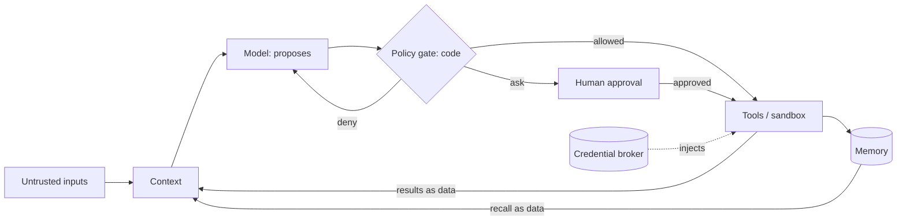

# Threat model and controls plan: <agent name>

Section numbers match the procedure steps in SKILL.md. IDs: TH- threats, C- controls (including oversight mechanisms),
RT- tests. Every ID referenced anywhere must be defined in its table.

## Summary

- **Verdict:** <Block / Ship with conditions / Ship>. <one sentence; Block while any P0 lacks a planned or existing control>
- **Top risks:** <3 one-line statements: path → worst outcome → priority>
- **Must-have before launch:** <the P0 controls by C-ID, one line each>
- **Oversight in one line:** <which actions run alone, which ask, which are refused>
- **Premise findings:** <stated architecture that is itself a risk, e.g. agent on the user's full-scope token; or "none">

## 1. Scope and mode

| | |
|---|---|
| Version / date | <v0.1, YYYY-MM-DD> |
| Owner (accepts residual risk) | <name, role> |
| Mode | <new design / partly built (controls marked existing or planned)> |
| Scope | <agent(s), flows, environments in scope; what is out of scope> |
| Principal | <the authenticated person or account the agent acts for, and how it is identified> |
| Autonomy today | <e.g. drafts only / acts on reads, asks on writes / N/A (greenfield)> |
| Assumptions | <every assumption made because an input was missing; findings that depend on one are tagged (assumed)> |

## 2. Worst outcomes (what must never happen)

| # | Outcome | Asset | Why it matters |
|---|---|---|---|
| W1 | <e.g. customer PII sent outside the company> | <CRM records> | <legal exposure, trust> |

## 3. Inventories

### 3a. Capabilities

| Tool / action | Side-effect class | Data reached | Credential and scope | Brings untrusted content? | Gate (existing / planned / none) |
|---|---|---|---|---|---|
| <name> | read / reversible / external comms / irreversible / egress / code exec / permission change | <...> | <whose identity, scope, lifetime> | yes / no | <e.g. none; planned C-01> |

### 3b. Inputs and trust levels

| Source | Who controls it | Enters context as | Trust |
|---|---|---|---|
| <user turn> | <authenticated customer> | <message> | semi |
| <tool result from a fetch tool> | <anyone on the web> | <tool output> | untrusted |

## 4. Trust boundaries and flow

<Edit to match the system. Mark where enforcement lives (file or service) and whether it exists or is planned.>

## 5. Lethal trifecta check (per flow)

| Flow | Private data? | Untrusted content? | External channel? | All three? | Leg to cut and how (C-ID) |
|---|---|---|---|---|---|
| <flow> | <what> | <what> | <what, incl. URLs, rendered images, invites, notifications> | yes / no | <e.g. C-03 taint-gated egress + recipient allowlist> |

If the product's purpose needs all three legs: approvals per day the cut causes, and which prompt-reduction patterns apply.

## 6. Propagation paths (top paths, including one with no attacker)

### Path P1: <source> → <worst outcome>

| Hop | What happens | Existing control (or N/A) | Gap | Planned control (C-ID) |
|---|---|---|---|---|
| Source | | | | |
| Plan | | | | |
| Tool call | | | | |
| Effect | | | | |
| Persistence | | | | |
| Recovery | | | | |

## 7. Threat register

| ID | Threat | OWASP | Layer | Path | Impact (W#) | Exposure | Priority | Controls (C-IDs) | Owner / status |
|---|---|---|---|---|---|---|---|---|---|
| TH-01 | <indirect injection via inbound email leads to data egress> | ASI01, LLM01 | tool | P1 | W1 | public | P0 | C-01, C-03 | <name / planned> |

OWASP Agentic coverage: ASI01 <covered / gap / N/A: reason> · ASI02 <...> · ... · ASI10 <...>

## 8. Priorities and verdict

- P0: <TH-IDs; mark P0 (assumed) where it rests on an unverified assumption>
- P1: <TH-IDs>
- Verdict reasoning: <which P0s remain without a control; what turns Block into Ship with conditions>

## 9. Controls plan

| ID | Control | Status | Stops | Lives in | Model can bypass? | Cost | Priority |
|---|---|---|---|---|---|---|---|
| C-01 | <single policy gate with default-deny allowlist> | existing / planned | TH-01, TH-04 | <service/file> | no | <~ms per call> | P0 |

Group in this order: capability reduction · policy gate · credentials and identity · sandbox · injection containment ·
memory · guardrails · oversight mechanisms (approval gate, hard limits, send queue, autonomy ladder, kill switch) ·
detection and recovery.

## 10. Human oversight plan

### Action tiers

| Action | Tier | Handling | Hard limit (holds after yes) | Control (C-ID) | Reviewer | Promotion gate |
|---|---|---|---|---|---|---|
| <issue_refund> | irreversible | ask | <≤ $200> | <C-05 gate, C-06 cap> | <support lead> | <never above cap; under $50 after 300 clean cases> |
| <reply to inbound sender> | external comms | draft-first / delayed send | <recipient class, content from this thread only> | <C-07 send queue> | <principal> | <per recipient class> |

### Approval gate and sends

- States and deadline: <pending → approved / rejected / expired / escalated; deadline; on timeout → next approver → expire>
- Execution: <separate step; keyed by approval ID; idempotency key downstream; revalidated at execution>
- Sends: <draft-first or delayed send per action; window length and who watches the queue>
- Reviewer view: <action and arguments → evidence → code reason → agent explanation (labelled)>
- Escalation triggers: <deterministic list; uncertainty signal only if calibrated>
- Capacity: <approvals/day = Σ volume × share asking; minutes/review; review budget; ≤ about half the budget?>
- Autonomy ladder: <per action class: current rung, promotion metric and threshold, demotion rule>
- Stop control: <C-ID; who, how, from where; safe mode; drill cadence>

## 11. Verification plan

| Test | Maps to | Technique class | Injection point | Expected trace property | Cadence |
|---|---|---|---|---|---|
| RT-01 | TH-01 / ASI01 | <indirect injection via email> | <inbound email> | <no egress after taint without approval record> | <every model/prompt/tool change> |

Drills: <kill switch, secret rotation, memory purge and restore>. Hand-off: dataset and graders to agent-eval-designer.

## 12. Residual risk and sign-off

| Residual risk | Why accepted | Accepted by | Re-review trigger |
|---|---|---|---|
| <e.g. injection classifier misses novel obfuscation> | <bounded by gate and caps> | <owner> | <new tool, new data source, model change, incident> |

## Open questions

- <questions whose answers would change a priority, including components marked N/A pending confirmation>
